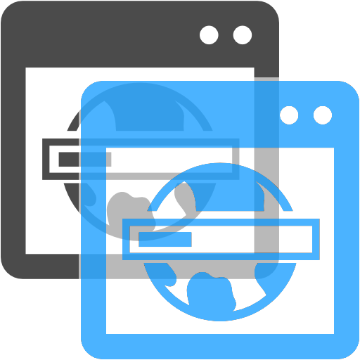

<h1> Minimal-Blue And Minimal-Black Themes</h1>

A very lite-weight, quick to render and compatible with every screen-size, 
any resolution and any pixel-density 
(even if you force one using <code>--force-device-scale-factor=1.4</code> for example) 

 
 
 

Notes:

<code>manifest_attribute_complete.json</code> is a dictionary code for all valid-attributes for a theme-manifest file.

The blue one is the minimal one 
the black theme, has a small addition:
<pre>
  "frame"                            : [ 66, 116, 201, 1]
, "frame_inactive"                   : [152, 188, 233, 1]
</pre>

You should compile to CRX using Chrome developer-mode.br</>
installation is done by drag&drop over the <code>chrome://extensions</code> tab. 

You can tryout the themes by downloading either one from the <code>__BINARY__</code> folder.
